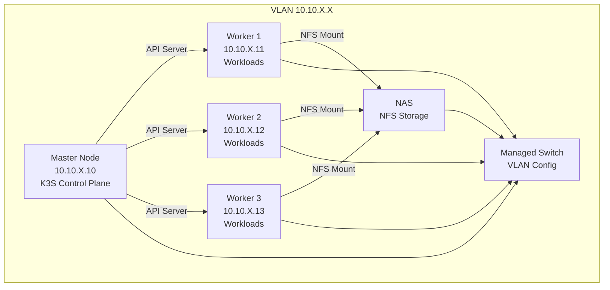

# Kapitel 1: Einführung

## Übersicht

In diesem Kapitel lernst du die Grundlagen von Kubernetes und K3S kennen, verstehst die Architektur deines zukünftigen Clusters und erfährst, warum wir die gewählten Tools verwenden.

## Was ist Kubernetes?

Kubernetes (oft als "K8s" abgekürzt) ist ein Open-Source-System zur Automatisierung der Bereitstellung, Skalierung und Verwaltung containerisierter Anwendungen. Es wurde ursprünglich von Google entwickelt und ist heute der De-facto-Standard für Container-Orchestrierung.

### Warum Kubernetes?

- **Automatisierung**: Deployments, Rollbacks, Skalierung automatisch
- **Skalierbarkeit**: Von einem Pod bis zu tausenden
- **Resilienz**: Automatische Neustarts bei Fehlern
- **Portabilität**: Läuft überall (Cloud, On-Premise, Edge)
- **Ecosystem**: Riesige Community und viele Tools

### Grundlegende Konzepte

Bevor wir tiefer einsteigen, hier die wichtigsten Kubernetes-Begriffe:

- **Node**: Ein physischer oder virtueller Server im Cluster
- **Pod**: Die kleinste Einheit in Kubernetes (ein oder mehrere Container)
- **Deployment**: Verwaltet Pods und stellt sicher, dass sie laufen
- **Service**: Stellt eine stabile Netzwerk-Adresse für Pods bereit
- **Namespace**: Logische Trennung von Ressourcen im Cluster

## Was ist K3S?

K3S ist eine leichtgewichtige, vollständig konforme Kubernetes-Distribution, die speziell für Edge Computing, IoT und ressourcenarme Umgebungen entwickelt wurde.

### Warum K3S statt Standard-Kubernetes?

- **Weniger Ressourcen**: ~512MB RAM für den Master, ~128MB pro Worker
- **Einfache Installation**: Ein Skript installiert alles
- **Alles inklusive**: SQLite statt etcd, eingebauter Load Balancer
- **Ideal für Homelab**: Perfekt für kleine bis mittlere Clusters

### K3S vs. Standard Kubernetes

| Feature | K3S | Standard K8s |
|---------|-----|--------------|
| Installation | Ein Skript | Komplex, viele Komponenten |
| Ressourcen | Minimal | Höher |
| etcd | SQLite (eingebaut) | Externer etcd-Cluster |
| Load Balancer | Eingebaut (ServiceLB) | Extern (MetalLB, etc.) |
| Ideal für | Edge, IoT, Homelab | Große Produktions-Cluster |

## Cluster-Architektur

Dein Cluster wird folgende Struktur haben:

### Master Node (Control Plane)

Der Master Node ist das Gehirn des Clusters:

- **API Server**: Zentrale Schnittstelle für alle Anfragen
- **Scheduler**: Entscheidet, wo Pods laufen
- **Controller Manager**: Verwaltet den gewünschten Zustand
- **kubelet**: Agent auf jedem Node
- **kube-proxy**: Netzwerk-Routing

### Worker Nodes

Die Worker Nodes führen die eigentlichen Workloads aus:

- **kubelet**: Kommuniziert mit dem Master
- **kube-proxy**: Netzwerk-Routing
- **Container Runtime**: Führt Container aus (containerd in K3S)

### Warum 1 Master und 3 Worker?

- **1 Master**: Minimiert Management-Overhead, ausreichend für Homelab
- **3 Worker**: Maximiert Ressourcen für Workloads, Redundanz für Verfügbarkeit

## Warum diese Tools?

### Kairos (Alpine-based)

**Was ist Kairos?**
Ein immutables, container-native Betriebssystem basierend auf Alpine Linux.

**Warum Kairos?**
- **Minimaler Footprint**: Sehr wenig Ressourcenverbrauch
- **Immutable**: System ist schreibgeschützt, Updates atomar
- **Cloud-Init**: Einfache Konfiguration über YAML
- **Ideal für Edge**: Perfekt für ressourcenarme Hardware

**Alternativen**: Ubuntu Server, Debian, aber größerer Footprint

### K3S

**Warum K3S?**
- Perfekt für Homelab (siehe oben)
- Einfache Installation und Wartung
- Vollständig Kubernetes-konform

**Alternativen**: k0s, MicroK8s, aber K3S ist am weitesten verbreitet

### OpenTofu

**Was ist OpenTofu?**
Ein Open-Source-Fork von Terraform für Infrastructure as Code.

**Warum OpenTofu?**
- **Infrastruktur als Code**: Netzwerk, DNS, etc. versioniert
- **Idempotent**: Mehrfaches Ausführen ist sicher
- **State Management**: Verfolgt aktuelle Infrastruktur

**Was verwenden wir es für?**
- IP-Adress-Management
- DNS-Einträge (falls vorhanden)
- Netzwerk-Konfiguration

**Alternativen**: Terraform (kommerziell), Pulumi (Code-basiert)

### Ansible

**Was ist Ansible?**
Ein Tool für Configuration Management und Automatisierung.

**Warum Ansible?**
- **Agentless**: Keine Software auf Ziel-Systemen nötig
- **Einfach**: YAML-basierte Playbooks
- **Idempotent**: Mehrfaches Ausführen ist sicher

**Was verwenden wir es für?**
- K3S Installation und Konfiguration
- System-Updates
- Node-Management
- Basis-Konfiguration

**Alternativen**: Puppet, Chef, aber Ansible ist am einfachsten

### Helm

**Was ist Helm?**
Der Package Manager für Kubernetes (wie apt/yum für Linux).

**Warum Helm?**
- **Einfache Installation**: Komplexe Apps mit einem Befehl
- **Templating**: Konfigurierbare Deployments
- **Versionierung**: Einfaches Upgrade/Downgrade

**Was verwenden wir es für?**
- App-Deployments (z.B. Nextcloud, GitLab, etc.)
- Standardisierte Konfigurationen

**Alternativen**: Kustomize, aber Helm ist Standard

## Homelab-spezifische Überlegungen

### Was ist anders als in Produktion?

1. **Keine High Availability**: 1 Master ist ausreichend
2. **Einfachere Storage**: NFS statt komplexer Storage-Lösungen
3. **Weniger Security**: Keine Multi-Tenancy nötig
4. **Experimentieren erwünscht**: Fehler sind Lernchancen

### Best Practices für Homelab

- **Backup-Strategie**: Regelmäßige Backups des Cluster-States
- **Monitoring**: Einfache Lösungen (Prometheus/Grafana)
- **Updates**: Regelmäßig, aber nicht kritisch
- **Dokumentation**: Deine Konfiguration dokumentieren

## Zusammenfassung

Du hast jetzt verstanden:
- Was Kubernetes und K3S sind
- Die Architektur deines zukünftigen Clusters
- Warum wir die gewählten Tools verwenden
- Homelab-spezifische Überlegungen

## Nächste Schritte

Bevor wir mit der Installation beginnen, müssen wir sicherstellen, dass alle Voraussetzungen erfüllt sind. Weiter zu [Kapitel 2: Voraussetzungen](02-prerequisites.md).

## Weiterführende Ressourcen

- [Kubernetes Dokumentation](https://kubernetes.io/docs/)
- [K3S Dokumentation](https://docs.k3s.io/)
- [Kairos Dokumentation](https://kairos.io/docs/)
- [Kubernetes Basics (interaktives Tutorial)](https://kubernetes.io/docs/tutorials/kubernetes-basics/)

