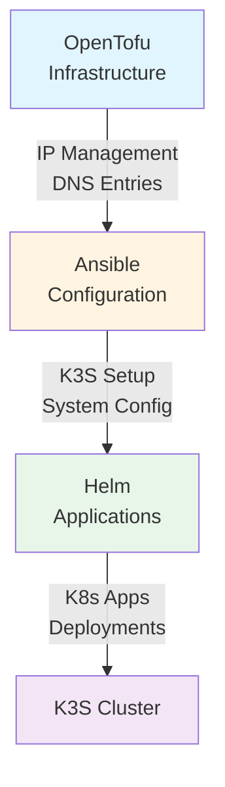
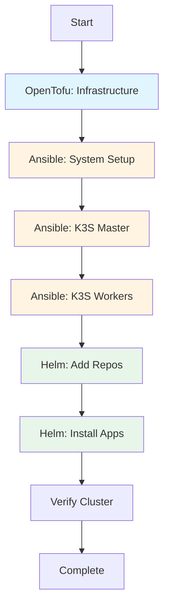

# Kapitel 11: IaC für Cluster-Management

## Übersicht

In diesem Kapitel lernst du, wie du OpenTofu, Ansible und Helm zusammen verwendest, um deinen Cluster vollständig als Code zu verwalten. Du wirst verstehen, wie die Tools zusammenarbeiten und einen Workflow entwickeln.

## Tool-Integration Übersicht

### Welches Tool für was?



**OpenTofu**: 
- Infrastruktur (IPs, DNS, Netzwerk)
- Dokumentation
- Templates

**Ansible**:
- System-Konfiguration
- K3S Installation
- Node-Management

**Helm**:
- Kubernetes-Anwendungen
- App-Deployments
- App-Updates

## Projekt-Struktur

### Empfohlene Struktur

```
cluster-iac/
├── opentofu/
│   ├── main.tf
│   ├── variables.tf
│   ├── outputs.tf
│   └── modules/
├── ansible/
│   ├── inventory.ini
│   ├── playbooks/
│   │   ├── k3s-master.yml
│   │   ├── k3s-workers.yml
│   │   └── system-setup.yml
│   ├── group_vars/
│   │   ├── all.yml
│   │   ├── master.yml
│   │   └── workers.yml
│   └── roles/
└── helm/
    ├── charts/
    │   └── my-app/
    └── values/
        ├── nginx.yaml
        └── postgres.yaml
```

## Workflow-Integration

### Phase 1: Infrastruktur (OpenTofu)

**Ziel**: Infrastruktur dokumentieren und konfigurieren

**Beispiel** (`opentofu/infrastructure.tf`):
```hcl
# IP-Management und Dokumentation
variable "nodes" {
  type = map(object({
    ip       = string
    hostname = string
    role     = string
  }))
  default = {
    master = {
      ip       = "10.10.10.10"
      hostname = "k3s-master"
      role     = "master"
    }
    worker-1 = {
      ip       = "10.10.10.11"
      hostname = "k3s-worker-1"
      role     = "worker"
    }
    # ... weitere Nodes
  }
}

# Output für Ansible
output "ansible_inventory" {
  value = {
    master = [for k, v in var.nodes : v if v.role == "master"]
    workers = [for k, v in var.nodes : v if v.role == "worker"]
  }
}
```

### Phase 2: System-Konfiguration (Ansible)

**Ziel**: Systeme konfigurieren und K3S installieren

**Beispiel**: OpenTofu Outputs in Ansible verwenden

**Option A: Manuell**
```bash
# OpenTofu Outputs anzeigen
cd opentofu
tofu output -json > ../ansible/inventory.json

# Ansible verwendet inventory.json
```

**Option B: Dynamic Inventory**
Erstelle `ansible/inventory_script.py`:
```python
#!/usr/bin/env python3
# Liest OpenTofu Outputs und generiert Ansible Inventory
import json
import sys

# Lese OpenTofu Outputs
with open('opentofu/outputs.json') as f:
    outputs = json.load(f)

# Generiere Inventory
inventory = {
    "master": {
        "hosts": [outputs["master_ip"]["value"]]
    },
    "workers": {
        "hosts": [w["value"] for w in outputs["worker_ips"]["value"]]
    }
}

print(json.dumps(inventory))
```

### Phase 3: App-Deployment (Helm)

**Ziel**: Anwendungen auf dem Cluster deployen

**Beispiel**: Helm mit Ansible

Erstelle `ansible/playbooks/deploy-apps.yml`:
```yaml
---
- name: Deploy applications with Helm
  hosts: localhost
  connection: local
  tasks:
    - name: Add Helm repositories
      command: helm repo add {{ item.name }} {{ item.url }}
      loop:
        - { name: "bitnami", url: "https://charts.bitnami.com/bitnami" }
      changed_when: false

    - name: Update Helm repositories
      command: helm repo update
      changed_when: false

    - name: Install nginx
      command: >
        helm upgrade --install nginx bitnami/nginx
        -f helm/values/nginx.yaml
        --namespace default
        --create-namespace
```

## Praktische Beispiele

### Beispiel 1: Vollständiger Cluster-Setup

**Workflow**:
1. OpenTofu: Infrastruktur dokumentieren
2. Ansible: K3S installieren
3. Helm: Basis-Apps installieren

**Script** (`scripts/setup-cluster.sh`):
```bash
#!/bin/bash
set -e

echo "=== Phase 1: Infrastructure (OpenTofu) ==="
cd opentofu
tofu init
tofu plan
tofu apply

echo "=== Phase 2: System Configuration (Ansible) ==="
cd ../ansible
ansible-playbook -i inventory.ini playbooks/system-setup.yml
ansible-playbook -i inventory.ini playbooks/k3s-master.yml
ansible-playbook -i inventory.ini playbooks/k3s-workers.yml

echo "=== Phase 3: Applications (Helm) ==="
cd ../helm
helm repo add bitnami https://charts.bitnami.com/bitnami
helm repo update
helm install nginx bitnami/nginx -f values/nginx.yaml

echo "=== Cluster Setup Complete ==="
```

### Beispiel 2: Node hinzufügen

**Workflow**:
1. OpenTofu: Neue IP dokumentieren
2. Ansible: Node konfigurieren
3. Ansible: K3S Worker installieren

**OpenTofu** (`opentofu/nodes.tf`):
```hcl
# Neuer Worker Node
resource "local_file" "worker_4_config" {
  filename = "${path.module}/nodes/worker-4.txt"
  content  = <<-EOT
    Hostname: k3s-worker-4
    IP: 10.10.10.14
    Role: worker
  EOT
}
```

**Ansible** (`ansible/playbooks/add-worker.yml`):
```yaml
---
- name: Add new worker node
  hosts: worker-4
  become: yes
  vars:
    k3s_master_ip: "10.10.10.10"
    k3s_token: "{{ hostvars['k3s-master']['k3s_token'] }}"
  tasks:
    - name: Install K3S Agent
      shell: |
        curl -sfL https://get.k3s.io | \
        K3S_URL=https://{{ k3s_master_ip }}:6443 \
        K3S_TOKEN={{ k3s_token }} sh -
```

### Beispiel 3: App-Update mit Helm

**Workflow**:
1. Helm: Chart aktualisieren
2. Helm: Upgrade durchführen
3. Verifikation

**Script** (`scripts/update-app.sh`):
```bash
#!/bin/bash
APP_NAME=$1
CHART=$2
VALUES_FILE=$3

# Repository aktualisieren
helm repo update

# App upgraden
helm upgrade $APP_NAME $CHART -f $VALUES_FILE

# Status prüfen
helm status $APP_NAME
kubectl get pods -l app=$APP_NAME
```

## Best Practices

### 1. Versionierung

```bash
# Git Repository für IaC
cluster-iac/
├── .gitignore
├── README.md
└── ...

# .gitignore
*.tfstate
*.tfstate.*
.terraform/
*.tfvars
!*.tfvars.example
```

### 2. Sensible Daten

**Nicht versionieren**:
- Passwörter
- Tokens
- Private Keys

**Verwende**:
- `ansible-vault` für Ansible
- `terraform.tfvars` (nicht versioniert) für OpenTofu
- Kubernetes Secrets für Helm

### 3. Dokumentation

**README.md**:
```markdown
# Cluster IaC

## Struktur
- `opentofu/`: Infrastructure as Code
- `ansible/`: Configuration Management
- `helm/`: Application Deployments

## Setup
1. OpenTofu: `cd opentofu && tofu apply`
2. Ansible: `cd ansible && ansible-playbook ...`
3. Helm: `helm install ...`
```

### 4. Testing

```bash
# OpenTofu: Plan vor Apply
tofu plan

# Ansible: Check Mode
ansible-playbook playbook.yml --check

# Helm: Dry-run
helm install app chart --dry-run --debug
```

## Workflow-Diagramm



## Automatisierung (optional)

### CI/CD Integration

**GitHub Actions Beispiel** (`.github/workflows/cluster.yml`):
```yaml
name: Deploy Cluster

on:
  push:
    branches: [main]

jobs:
  deploy:
    runs-on: ubuntu-latest
    steps:
      - uses: actions/checkout@v2
      
      - name: Setup OpenTofu
        run: |
          # Install OpenTofu
          
      - name: Apply Infrastructure
        run: |
          cd opentofu
          tofu apply -auto-approve
          
      - name: Setup Ansible
        run: |
          pip install ansible
          
      - name: Configure Cluster
        run: |
          cd ansible
          ansible-playbook playbooks/setup.yml
```

## Troubleshooting

### Problem: OpenTofu State out of sync

**Lösung**:
```bash
# State refreshen
tofu refresh

# State importieren (falls nötig)
tofu import <resource> <id>
```

### Problem: Ansible kann Nodes nicht erreichen

**Lösung**:
```bash
# SSH-Verbindung testen
ansible all -i inventory.ini -m ping

# Inventory prüfen
ansible-inventory -i inventory.ini --list
```

### Problem: Helm Chart fehlt

**Lösung**:
```bash
# Repository aktualisieren
helm repo update

# Chart suchen
helm search repo <chart-name>
```

## Checkliste

Du solltest jetzt verstehen:
- [ ] Wie die Tools zusammenarbeiten
- [ ] Welches Tool für welche Aufgabe
- [ ] Wie du einen Workflow entwickelst
- [ ] Best Practices für IaC
- [ ] Wie du den Cluster vollständig als Code verwaltest

## Nächste Schritte

Jetzt, da du verstehst, wie du alle Tools zusammen verwendest, geht es weiter mit [Kapitel 12: Storage (NFS)](12-storage-nfs.md), wo du lernst, wie du persistenten Storage für deine Anwendungen einrichtest.

## Weiterführende Ressourcen

- [OpenTofu Best Practices](https://opentofu.org/docs)
- [Ansible Best Practices](https://docs.ansible.com/ansible/latest/user_guide/playbooks_best_practices.html)
- [Helm Best Practices](https://helm.sh/docs/chart_best_practices/)
- [GitOps mit Kubernetes](https://www.weave.works/technologies/gitops/)

